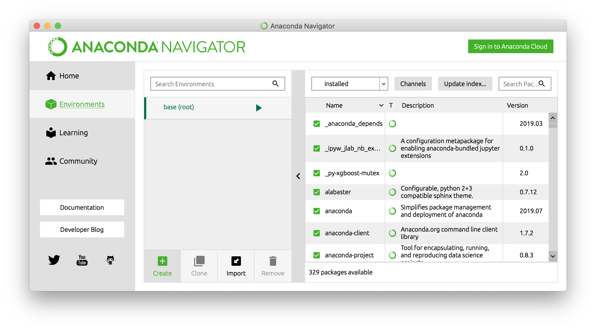
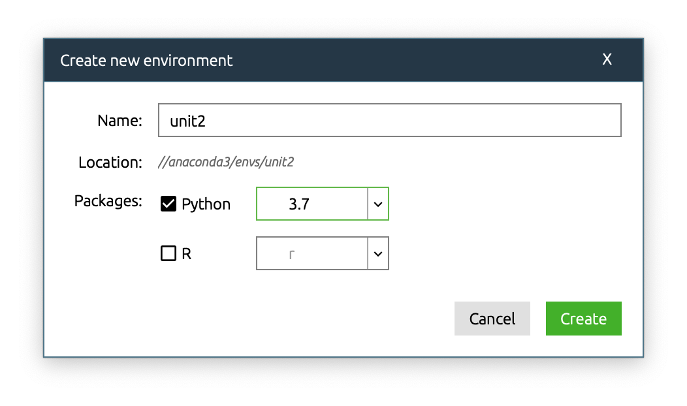
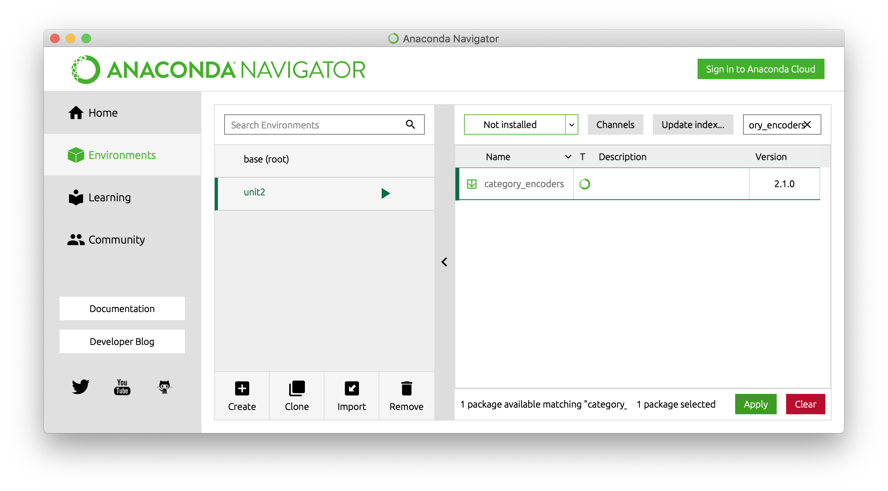
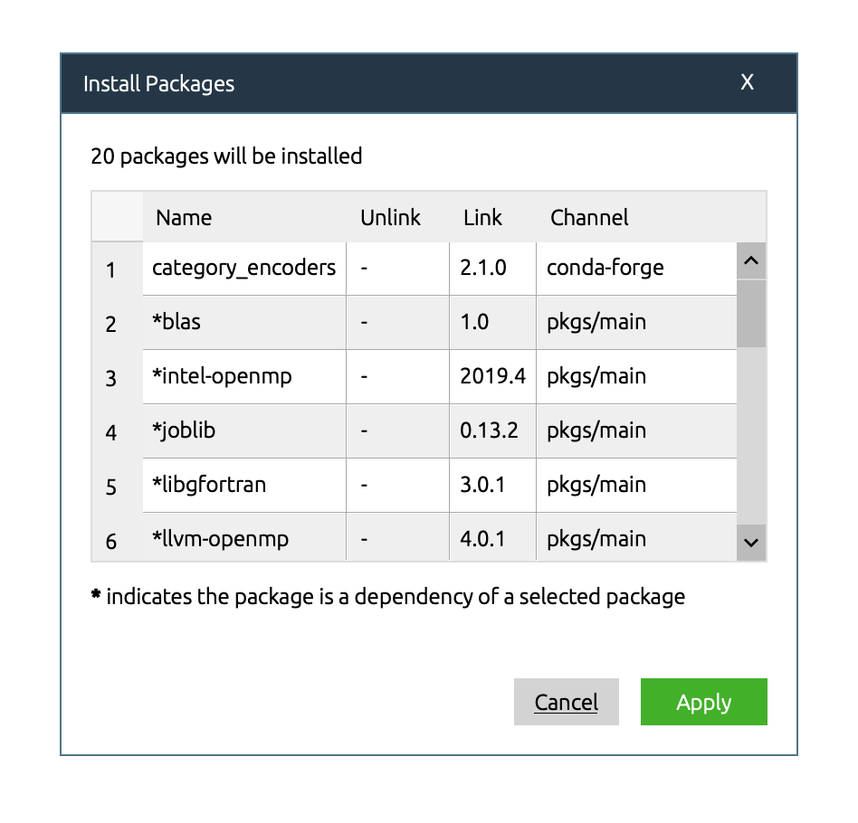
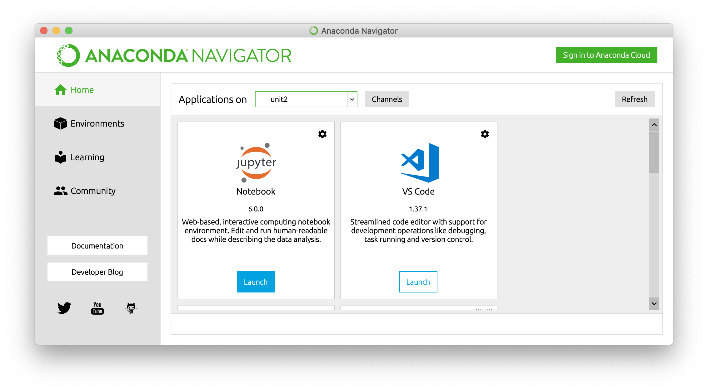

[DS](/ds) > [Unit 2](/ds/unit2) > Local Setup


# Local Setup

1. Install Anaconda
2. Create conda environment
3. Install packages
4. Launch Jupyter Notebook

# 1. Install Anaconda

[Download the Anaconda installer](https://www.anaconda.com/distribution/), Python 3.7 version, for your operating system: Windows, macOS, or Linux.

Then run the Installer you downloaded.

([Anaconda has more documentation available.](https://docs.anaconda.com/anaconda/install/))

# 2. Create conda environment

A [conda environment](https://docs.anaconda.com/anaconda/navigator/glossary/#navigator-glossary-conda-environment) "contains a specific collection of conda packages and their dependencies, so they can be maintained and run independently without interfering with each other." 

We use conda environments to help our projects be reproducible and prevent [conflicts](https://www.explainxkcd.com/wiki/index.php/1987:_Python_Environment) between projects.

(Want to learn more? We recommend [The Definitive Guide to Conda Environments](https://towardsdatascience.com/a-guide-to-conda-environments-bc6180fc533).)

You have two options: you can create a conda environment either using a command line interface, or a graphical user interface.

### Command line option

Windows users, [open **Anaconda Prompt**.](https://docs.anaconda.com/anaconda/user-guide/getting-started/#open-anaconda-prompt)

Mac users, [open **Terminal**.](https://support.apple.com/guide/terminal/open-or-quit-terminal-apd5265185d-f365-44cb-8b09-71a064a42125/mac)

Then enter this command, to [create a conda environment](https://docs.conda.io/projects/conda/en/latest/user-guide/tasks/manage-environments.html#creating-an-environment-with-commands) named `unit2`, with Python 3.7.

```
conda create -n unit2 python=3.7
```


### Graphical user interface option

If you prefer, you can use a graphical user interface instead of the command line.

Start Anaconda Navigator. [See instructions here](https://docs.anaconda.com/anaconda/navigator/getting-started/#navigator-starting-navigator) for Windows, Mac, or Linux.

In Navigator, click the **Environments** tab. Then click the **Create** button.



Give your environment a name, such as **unit2**. Select Packages for Python version **3.7**. Then click the **Create** button.



You'll see a message, "Creating environment", in the bottom-right corner of the window. When the process finishes, continue to the next section of these instructions.

([Anaconda has more documentation available.](https://docs.anaconda.com/anaconda/navigator/tutorials/manage-environments/#creating-a-new-environment))


# 3. Install packages

A [conda package](https://docs.anaconda.com/anaconda/navigator/glossary/#navigator-glossary-conda-pkg) "contains everything that a software program needs in order to be installed and run, so you do not have to manually find and install each dependency separately. This can include system-level libraries, Python modules, executable programs and other components. Managed with conda or Anaconda Navigator." 

Again, you have two options: you can install packages either using the command line interface, or the graphical user interface.

### Command line option

[Activate the environment:](https://docs.conda.io/projects/conda/en/latest/user-guide/tasks/manage-environments.html#activating-an-environment)

```
conda activate unit2
```

[Add the conda-forge channel.](https://docs.conda.io/projects/conda/en/latest/user-guide/tasks/manage-channels.html) "Conda channels are the locations where packages are stored. They serve as the base for hosting and managing packages."

```
conda config --add channels conda-forge
```

[Install](https://docs.conda.io/projects/conda/en/latest/user-guide/tasks/manage-pkgs.html#installing-packages) these packages used in Unit 2. (Anaconda will also automatically install any dependencies of these packages, including
matplotlib, numpy, pandas, python-graphviz, and scikit-learn.)

```
conda install category_encoders eli5 pdpbox plotly py-xgboost seaborn shap
```

### Graphical user interface option

[Start Anaconda Navigator](https://docs.anaconda.com/anaconda/navigator/getting-started/#navigator-starting-navigator), if it's not already open.

In Navigator, click the **Environments** tab. Select the **unit2** environment. 

Click the **Channels** button. If you do not see `conda-forge` in the channels list, then click the **Add** button, type `conda-forge`, and click the **Update channels** button.

In the Search Packages box, type the name of the package. For example: **category_encoders**

Select the **Not Installed** filter to list all packages that are available in the environment’s channels but are not installed.

Select the name of the package you want to install. For example: **category_encoders**

Click the **Apply** button.



In the Install Packages popup, click the **Apply** button.



Repeat this process to install these packages used in Unit 2:

- **category_encoders**
- **eli5**
- **pdpbox**
- **plotly**
- **py-xgboost**
- **seaborn**
- **shap**

When you install these packages, Anaconda will also automatically install any dependencies of these packages, including
**matplotlib, numpy, pandas, python-graphviz,** and **scikit-learn.**

([Anaconda has more documentation available.](https://docs.anaconda.com/anaconda/navigator/tutorials/manage-packages/#installing-a-package))

# 4. Launch Jupyter Notebook

### Command line option

```
conda activate unit2
```

```
jupyter notebook
```

### Graphical user interface option

[Start Anaconda Navigator](https://docs.anaconda.com/anaconda/navigator/getting-started/#navigator-starting-navigator), if it's not already open.

In Navigator, click the **Home** tab. 

In the **Applications on** drop-down menu, select the **unit2** environment.

Click the **Launch** button for **Jupyter Notebook**.



Congratulations, you have launched a Jupyter Notebook in the unit2 conda environment!
